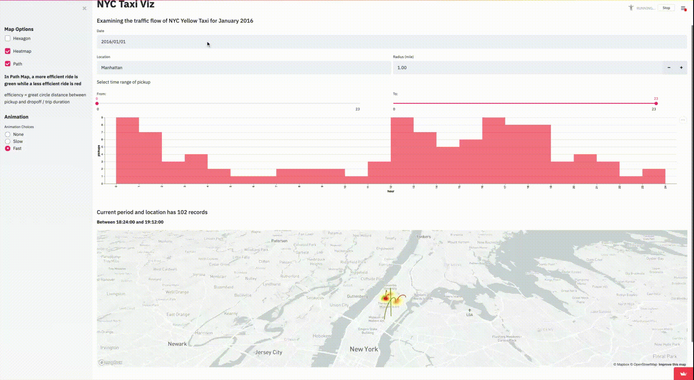

# NYC Taxi Viz 
Authors: 
Yifan Song(yifanson@cmu) & Weiqin Wang(weiqinw@cmu)

# Abstract

NYC Taxi Viz is an interactive data visualization framework that allows the users to explore the traffic flow of NYC taxi. Users can query for specific date, location and time range, as well as choose different types of map layers. The framework also provides the animation function to let users see the dynamic change of traffic flow across time.

# Project Goals

Describe the question that you are enabling a user to answer. The question should be compelling and the solution should be focused on helping users achieve their goals. 

We aim to develop a tool that allows users to dynamically explore the traffic flow of NYC taxi by user specified date-time and locations.  The users can use the tool to answer the  question: given a specified pick-up location, how the traffic flow bandwidth and direction change overtime. 

# Design

**A rationale for your design decisions.** How did you choose your particular visual encodings and interaction techniques? What alternatives did you consider and how did you arrive at your ultimate choices?

### Hour Slider Bars:
We allow the users to specify specific date using calendar and hours-span using slider bar. We have two slider bars for users to choose the start and end hours of the day(dynamic query). We have tried with other user input interfaces such as textbox, but the slider bar allows the users to have a better interaction experience.

### Date query range:
The query condition meets the objective for users to track traffic flow. The users can clearly see the traffic flow for different dates or different hours. For example, the difference of traffic flow between morning time 8:00 am vs night time 11:00 pm or weekdays vs weekends. 

We have experimented with giving users different query choices. For example instead of a specific date, the users can choose a range of days. However, the query choice leads to very large overplot query results which are mostly meaningless from the users' perspective and very expensive for Streamlight to render.  Therefore, we choose to allow users to only query on a specific date. 
### Location 
The users can specify the address and radius to find the traffic flow of a given area. 

### Query order:
The users will specify the date, then the location, radius, and finally the hour span of the day. 
The location and radius search is potentially expensive and time-consuming. The user will first input a location, then given the address, we determine all the pick-ups within the radius of the location.  The users can specify the radius to determine the information(detail on demand). 

Specify the date first can potentially greatly reduce the search space for location filtering. Here the trade-off is whether the users will base on the date and then filter for the location or base on the location and filter for the date.  If for the latter,  the location filter should be conducted first to optimize the query speed.  We implemented in both orders and decided to use the first date then the location approach and the hours. We believe the interface provides the best usability. Additionally, the interface allows users to first determine a date and location,  then use the slider bar to explore the hourly traffic flow. 

### Barchart: 
We plot the distribution of the traffic flow based on the user-specfied date. 

### Zoom: 
The zoom level is determined dynamically based on the query condition. When the user selects a particular location with a radius, the map will be zoomed to the location given radius range. When the show path option is chosen, the zoom will be set 11 to allow users to clearly see the traffic flow.

### Interactive Graph: 
The users can choose two different map layers to show the pick-up distribution: HexagonLayer, Heat-map. They also have the option to show the path from pick-up to drop-off. 
We use the color of encoding to represent the estimated speed(using the great circle distance/(pickup time - dropoff time) of the traffic flow, where more green means higher speed and more red means lower speed.  We have experimented with different color encoding combinations, and find out the green and red color encoding is most intuitive and clear. 

### Animation:
We created the animation for the following reasons. 
1. Users can see the dynamic traffic flow given the specified location and time-span.
2. When the query results are large, the pick-up and drop-off path become intractable for users, so the animation can help breakdown the traffic flow in a mini-scale. 

The animation is set to be 30 frames generated from the selected time span.  
The users can first see the traffic flow for the day to gain a general intutition. If the users see certain traffic flow during certain hours that need more close attention, they can choose to explore the traffic flow in detail using the time slider bar. 

# Development

### Overview 
We are a highly collaborative team. After we picked the dataset, we carefully  discussed  and determined the general objective.

Weiqin was in charge of pre-processing data, interactive graphic design of path etc, dynamic filtering using date-time, location,velocity calcuation, interactive graph animation. 

Yifan was in charge of color encoding of taxi path using velocity, dynamic filtering using date-time,  interactive graph animation, design and code structure refinement. 

Each of us spent roughly 25 hours on the project. 

The most time-consuming part was to determine the most effective visual and interactive design so that the audiences can better use our tool.  For example, we have tried to alter the query order, color encoding, layers of map. The experiments were very time-consuming, but it allowed us to better understand and find the best features to have for the tool.

### Dataset
We used the NYC Taxi Trip Duration dataset. The dataset originally has 1458644 trip records of 2016 NYC Yellow Cab. For this project, we are particularly interested in the trip-record of 2016/01/01 - 2016/01/31 the post-holiday month, so we resample the month January of the data which is 222038 records.  

### Date and Location filtering 
We allow the user to query base on the date and time. Given the user-specified address, we use the geo API to find the corresponding longitude and latitude. Then we find all pick-ups falls into the user-specified circle, where the center is a user-specified address.

### Animation and Color encoding
We use the pick-up and drop-off locations to find the displacement. Then given the displacement, we find the speed, then we encode the Red and Green for the trip efficiency rate use the velocity by using 255- velo*255/maxvelo and velo*255/maxvelo. 
# References

Calculation for location based search: https://stackoverflow.com/questions/58548566/selecting-rows-in-geopandas-or-pandas-based-on-latitude-longitude-and-radius   
Map layers(given in class): https://github.com/streamlit/demo-uber-nyc-pickups/blob/master/streamlit_app.py

